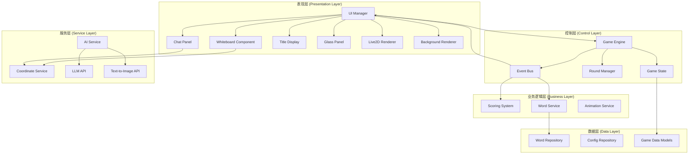

# AI Sketch Duel - 系统架构设计方案

基于pygame+OpenGL混合编程项目和设计草案，本文档提供了一套完整的系统架构方案。

## 推荐文件目录结构

```
transferMe/
├── game/
│   ├── __init__.py
│   ├── main.py                    # 游戏入口文件
│   ├── core/                      # 核心游戏逻辑
│   │   ├── __init__.py
│   │   ├── game_engine.py         # 游戏主引擎
│   │   ├── game_state.py          # 游戏状态管理
│   │   ├── event_bus.py           # 事件总线系统
│   │   ├── round_manager.py       # 回合管理器
│   │   └── scoring_system.py      # 积分系统
│   ├── ui/                        # 用户界面层
│   │   ├── __init__.py
│   │   ├── ui_manager.py          # UI管理器
│   │   ├── components/            # UI组件
│   │   │   ├── __init__.py
│   │   │   ├── whiteboard.py      # 白板组件
│   │   │   ├── chat_panel.py      # 聊天面板
│   │   │   ├── title_display.py   # 标题显示
│   │   │   ├── round_indicator.py # 回合指示器
│   │   │   └── glass_panel.py     # 玻璃拟态框
│   │   ├── renderers/             # 渲染器
│   │   │   ├── __init__.py
│   │   │   ├── live2d_renderer.py # Live2D渲染器
│   │   │   ├── background_renderer.py # 背景渲染器
│   │   │   └── ui_renderer.py     # UI渲染器
│   │   └── styles/                # 样式定义
│   │       ├── __init__.py
│   │       ├── colors.py          # 颜色配置
│   │       └── fonts.py           # 字体配置
│   ├── services/                  # 服务层
│   │   ├── __init__.py
│   │   ├── ai_service.py          # AI服务(LLM+T2I)
│   │   ├── word_service.py        # 选词服务
│   │   ├── coordinate_service.py  # 坐标转换服务
│   │   └── animation_service.py   # 动画服务
│   ├── data/                      # 数据层
│   │   ├── __init__.py
│   │   ├── models/                # 数据模型
│   │   │   ├── __init__.py
│   │   │   ├── game_data.py       # 游戏数据模型
│   │   │   ├── player.py          # 玩家模型
│   │   │   └── word.py            # 词汇模型
│   │   └── repositories/          # 数据仓库
│   │       ├── __init__.py
│   │       ├── word_repository.py # 词库仓库
│   │       └── config_repository.py # 配置仓库
│   ├── utils/                     # 工具函数
│   │   ├── __init__.py
│   │   ├── constants.py           # 常量定义
│   │   ├── helpers.py             # 辅助函数
│   │   └── validators.py          # 验证器
│   ├── config/                    # 配置文件
│   │   ├── __init__.py
│   │   ├── game_config.py         # 游戏配置
│   │   ├── ai_config.py           # AI配置
│   │   └── ui_config.py           # UI配置
│   └── Resources/                 # 资源文件(保持现有结构)
│       ├── RING.png
│       ├── v2/
│       └── v3/
├── docs/                          # 文档(保持现有)
├── words.json                     # 词库文件
├── requirements.txt               # 依赖文件
└── README.md
```

## 系统架构图 (Mermaid)



## 分层框架设计

### 1. 表现层 (Presentation Layer)
**职责**: 处理所有用户界面渲染和用户交互
- **UI Manager**: 统一管理所有UI组件的渲染顺序和事件分发
- **组件化设计**: 每个UI元素独立封装，便于维护和复用
- **坐标转换**: 统一处理pygame和OpenGL坐标系差异

### 2. 控制层 (Control Layer) 
**职责**: 游戏流程控制和状态管理
- **Game Engine**: 主控制器，协调各个系统
- **Game State**: 集中管理游戏状态，使用状态机模式
- **Event Bus**: 事件驱动架构，实现模块间解耦通信
- **Round Manager**: 专门处理回合逻辑和切换

### 3. 业务逻辑层 (Business Layer)
**职责**: 实现具体的游戏规则和逻辑
- **Scoring System**: 积分计算和排行榜管理
- **Word Service**: 词汇选择和提示系统
- **Animation Service**: Live2D动画控制和触发

### 4. 服务层 (Service Layer)
**职责**: 提供外部服务和工具支持
- **AI Service**: 封装LLM和T2I模型调用，支持异步处理
- **Coordinate Service**: 坐标系转换的统一服务
- **配置服务**: 管理各种配置参数

### 5. 数据层 (Data Layer)
**职责**: 数据存储和访问
- **Repository模式**: 统一数据访问接口
- **Model定义**: 清晰的数据结构定义
- **配置管理**: 集中管理游戏配置

## 关键设计原则

1. **单一职责**: 每个类和模块只负责一个明确的功能
2. **依赖注入**: 通过接口依赖，便于测试和扩展
3. **事件驱动**: 使用事件总线实现松耦合通信
4. **异步处理**: AI服务调用不阻塞主线程
5. **坐标统一**: 专门的服务处理pygame/OpenGL坐标转换
6. **组件化UI**: 每个UI元素独立封装，支持复用

## 实现建议

1. **优先级**: 先实现核心游戏逻辑框架，再逐步添加AI功能
2. **测试**: 每个模块都应该有对应的单元测试
3. **配置**: 使用配置文件管理游戏参数，便于调试
4. **日志**: 添加完善的日志系统，便于问题排查
5. **性能**: 注意渲染性能，合理使用缓存和批处理

---

# 开发规范与指南

## 命名规范 (Naming Conventions)

### 文件和模块命名
- **Files/Modules**: 使用 snake_case (`user_profile.py`)
- **包目录**: 使用 snake_case (`game_logic/`)
- **配置文件**: 使用 snake_case (`game_config.py`)

### 代码命名
- **Classes**: 使用 PascalCase (`UserProfile`, `GameEngine`)
- **Functions/Variables**: 使用 snake_case (`get_user_data`, `current_round`)
- **Constants**: 使用 UPPER_SNAKE_CASE (`API_BASE_URL`, `MAX_ROUNDS`)
- **Private methods**: 前缀下划线 (`_private_method`, `_internal_state`)
- **Protected methods**: 单下划线前缀 (`_protected_method`)
- **Magic methods**: 双下划线包围 (`__init__`, `__str__`)

### 示例
```python
# 文件: game_engine.py
class GameEngine:
    MAX_PLAYERS = 2  # 常量
    
    def __init__(self):
        self.current_state = None  # 公共属性
        self._internal_timer = 0   # 受保护属性
        self.__secret_key = "abc" # 私有属性
    
    def start_game(self) -> bool:  # 公共方法
        return self._initialize_components()
    
    def _initialize_components(self) -> bool:  # 受保护方法
        pass
```

## 🐍 Python 开发指南

### 类型提示 (Type Hints)

#### 基本类型提示
```python
from typing import List, Dict, Optional, Union, Tuple, Callable
from pathlib import Path

def process_scores(scores: List[int]) -> float:
    """计算平均分数"""
    return sum(scores) / len(scores)

def get_player_info(player_id: str) -> Optional[Dict[str, Union[str, int]]]:
    """获取玩家信息，可能返回None"""
    pass

def load_config(config_path: Path) -> Dict[str, any]:
    """从文件加载配置"""
    pass
```

#### 复杂类型提示
```python
from typing import Protocol, TypeVar, Generic

# 协议定义
class Drawable(Protocol):
    def draw(self, surface: any) -> None:
        ...

# 泛型类型
T = TypeVar('T')

class Repository(Generic[T]):
    def save(self, item: T) -> bool:
        pass
    
    def find_by_id(self, item_id: str) -> Optional[T]:
        pass

# 回调函数类型
EventCallback = Callable[[str, Dict[str, any]], None]
```

### 代码风格 (Code Style)

#### 遵循 PEP 8 规范
```python
# 好的示例
class WhiteboardComponent:
    """白板组件类，负责绘画功能"""
    
    def __init__(self, width: int, height: int) -> None:
        self.width = width
        self.height = height
        self._drawing_history: List[DrawAction] = []
    
    def clear_board(self) -> None:
        """清空白板内容"""
        self._drawing_history.clear()
        self._notify_observers('board_cleared')
    
    def _notify_observers(self, event: str) -> None:
        """通知观察者事件发生"""
        # 实现细节...
        pass
```

#### 函数设计原则
```python
# 单一职责 - 好的示例
def calculate_score(correct_answers: int, total_time: float) -> int:
    """根据正确答案数和用时计算分数"""
    base_score = correct_answers * 10
    time_bonus = max(0, 60 - total_time) * 2
    return int(base_score + time_bonus)

def validate_player_name(name: str) -> bool:
    """验证玩家姓名是否有效"""
    return len(name.strip()) >= 2 and name.isalnum()

# 避免过长的函数
def process_game_round(game_state: GameState) -> RoundResult:
    """处理游戏回合"""
    word = _select_random_word(game_state.difficulty)
    drawing_result = _handle_drawing_phase(word, game_state.current_player)
    guessing_result = _handle_guessing_phase(drawing_result, game_state.other_players)
    return _calculate_round_result(drawing_result, guessing_result)
```

#### 文档字符串规范
```python
def start_ai_drawing(word: str, difficulty: str = 'medium') -> DrawingResult:
    """
    启动AI绘画过程
    
    Args:
        word: 要绘画的词汇
        difficulty: 难度级别 ('easy', 'medium', 'hard')
    
    Returns:
        DrawingResult: 包含生成的图片和元数据
    
    Raises:
        AIServiceError: 当AI服务不可用时
        InvalidWordError: 当词汇无效时
    
    Example:
        >>> result = start_ai_drawing("苹果", "easy")
        >>> print(result.image_path)
        '/tmp/ai_drawing_apple.png'
    """
    pass
```

### 最佳实践 (Best Practices)

#### 1. 使用列表推导式
```python
# 好的示例
valid_words = [word for word in word_list if len(word) > 3]
scores = [calculate_score(player) for player in players]

# 复杂情况使用生成器
processed_data = (process_item(item) for item in large_dataset if item.is_valid)
```

#### 2. 使用 pathlib 处理文件路径
```python
from pathlib import Path

# 好的示例
config_dir = Path(__file__).parent / 'config'
config_file = config_dir / 'game_settings.json'

if config_file.exists():
    with config_file.open('r', encoding='utf-8') as f:
        config = json.load(f)
```

#### 3. 使用上下文管理器
```python
# 文件操作
with open('game_log.txt', 'w') as f:
    f.write(f"Game started at {datetime.now()}")

# 自定义上下文管理器
class GameSession:
    def __enter__(self):
        self.start_time = time.time()
        return self
    
    def __exit__(self, exc_type, exc_val, exc_tb):
        duration = time.time() - self.start_time
        logging.info(f"Game session lasted {duration:.2f} seconds")

# 使用
with GameSession() as session:
    # 游戏逻辑
    pass
```

#### 4. 异常处理
```python
import logging
from typing import Optional

def load_ai_model(model_path: str) -> Optional[AIModel]:
    """
    加载AI模型，处理各种可能的异常
    """
    try:
        model = AIModel.load(model_path)
        logging.info(f"Successfully loaded model from {model_path}")
        return model
    except FileNotFoundError:
        logging.error(f"Model file not found: {model_path}")
        return None
    except ModelLoadError as e:
        logging.error(f"Failed to load model: {e}")
        return None
    except Exception as e:
        logging.exception(f"Unexpected error loading model: {e}")
        return None
```

#### 5. 使用 logging 模块
```python
import logging
from pathlib import Path

# 配置日志
logging.basicConfig(
    level=logging.INFO,
    format='%(asctime)s - %(name)s - %(levelname)s - %(message)s',
    handlers=[
        logging.FileHandler('game.log'),
        logging.StreamHandler()
    ]
)

logger = logging.getLogger(__name__)

class GameEngine:
    def start_game(self):
        logger.info("Starting new game session")
        try:
            self._initialize_components()
            logger.info("Game components initialized successfully")
        except Exception as e:
            logger.exception(f"Failed to start game: {e}")
            raise
```

#### 6. 配置管理
```python
from dataclasses import dataclass
from pathlib import Path
import json

@dataclass
class GameConfig:
    """游戏配置数据类"""
    max_rounds: int = 3
    drawing_time_limit: int = 60
    ai_model_path: str = "models/default.bin"
    debug_mode: bool = False
    
    @classmethod
    def load_from_file(cls, config_path: Path) -> 'GameConfig':
        """从文件加载配置"""
        with config_path.open('r') as f:
            data = json.load(f)
        return cls(**data)
    
    def save_to_file(self, config_path: Path) -> None:
        """保存配置到文件"""
        with config_path.open('w') as f:
            json.dump(self.__dict__, f, indent=2)
```

这个架构设计充分考虑了坐标系转换问题，并且遵循了高内聚低耦合的设计原则。每个模块职责明确，便于团队协作和后续维护扩展。
        